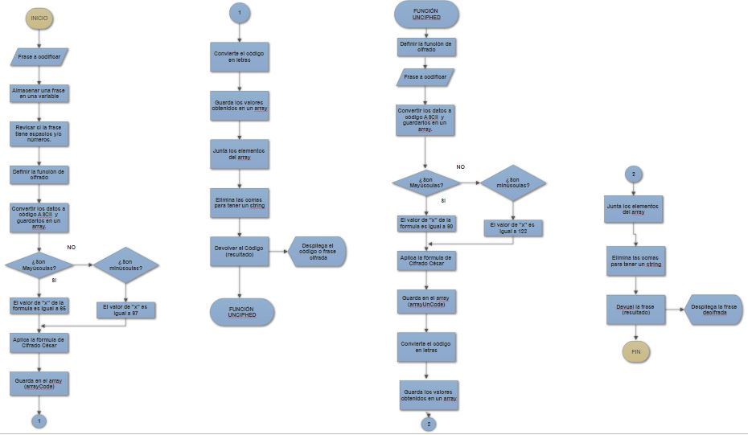

# *Pseudocódigo*

1. Ingresar la frase a codificar.
2. Guardar en una variable la frase.
3. Revisar si el mensaje tiene espacios y números, si los tiene devolver mensaje de que los posee y que ingrese otra frase.
4. Definir la función cipher
5. Declarar las variables que ayudarán a operar, como arreglos vacíos y demás.
6. Crear un array e ir guardando los valores en código ASCII.
7. Validar que sean mayúsculas, si lo son la posición o el valor de "x" en la función es 65.
8. Aplicar la ecuación del cifrado, desplazando y conviritendo al código ASCII del cifrado.
9. Convertir el código en letras y guardarlo en un array.
10. Unir los elementos del array y eliminar las comas para obtener un string.
11. Desplegar el resultado. La frase codificada.
11. Crear la función uncipher y recibir la frase a decifrar
12. Convertir los datos del código ASCII y guardarlos en un array.
13. Validar que sean mayúsculas para asignarle al valor de "x" de la ecuación 90 y si son minúsculas 122.
14. Efectuar el desplazamiento, realizar el cifrado y almacenar los datos en un array (arrayUnCode).
15. Convertir el código ASCII del array en letras y guardarlas en un array.
16. Juntar o concatenar los elementos del array resultante y eliminar las comas.
17. Mostrar el resultado, la frase convertida a código.

## *Diagrama de Flujo*

