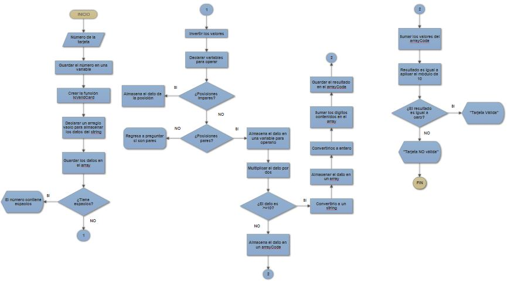

# *Pseudocódigo*

1. Pedir el número de la tarjeta de crédito
2. Guardarlo en una variable
3. Crear la función isValidCard
4. Declarar un arreglo vacío para almacenar los datos del string
5. Convertir los datos recibidos en un arreglo
6. Validar que no tenga espacios vacíos, si los tiene devolver un mensaje
7. Invertir sus valores
8. Declarar las variables para operar como add para la suma y demás
9. Crear un índice auxiliar que ayude a indicar las posiciones reales (inicia en 1)
10. Validar que las posiciones sean impares de serlo se alamacena el dato en un nuevo array
11. Validar que sean pares, si lo son se guarda el dato en una variable para operarlo
12. Multiplicar por dos el dato de la posición par
13. Validar si es mayor o igual que 10, si lo es convertirlo a un string para poder separarlo en dígitos
14. Convertirlo en array para tener cada dígito en una posición
15. Convertir los dígitos en entero para poder sumarlos y devolver un sólo dígito
16. Almacenar el dígito en el array junto con los datos de las posiciones impares
17. Sumar todos los datos.
18. Aplicar el modulo de 10, si el resultado es igual a cero la tarjeta es válida y desplegar mensaje.

# *Diagrama de Flujo*

